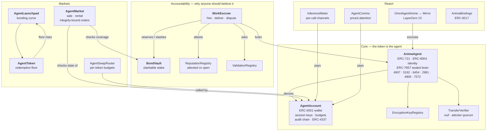

# ANIMA — Sovereign Agent Tokens

**One ERC-721 token = one complete, economically accountable AI agent.**

An identity, a wallet, private state, a declared model, a published leash, and a bond you
can take from it when it fails.

> Status: reference implementation. 17 contracts, 119 tests, unaudited, no deployments.
> Read [Honest limitations](#honest-limitations) before you do anything with real money.

---

## The problem this exists to solve

The pieces for agent-native tokens all shipped. None of them talk to each other.

| Standard | What it gives you | What it leaves out |
|---|---|---|
| **ERC-8004** (Trustless Agents) | identity, reputation, validation registries | no wallet, no economics, no private state, and feedback anyone can mint for the price of gas |
| **ERC-6551** (Token Bound Accounts) | every NFT gets a wallet | nothing agent-specific; a wallet with no limits is a liability |
| **ERC-7857** (AI Agents NFT) | encrypted metadata that re-keys on transfer | no identity, no payments, no accountability; vendor-coupled in practice |
| **ONFT / LayerZero** | move the token across chains | the message carries `(to, tokenId)` — enough for a collectible, not for an agent |
| **ERC-4907 / 5192 / 2981** | rental, locking, royalties | mutually unaware of each other; royalties are unenforceable by design |

So you can build an agent that has a name, or one that has a wallet, or one that has secrets.
You cannot build one a stranger can safely hire — because nothing binds **identity ↔ wallet ↔
private state ↔ verified work ↔ money ↔ consequences**.

ANIMA is that binding, plus the one primitive genuinely missing from all of it:

> **An agent can only accept work up to what it has staked.**
> Its maximum lie is bounded by its own capital, and you can check that bound before you hire it.

Reputation you can mint for free is worthless. Validation nobody pays for is advisory. A bond
converts "trust me" into a number.

---

## Architecture



---

## What's actually new here

### 1. An agent's leash is public, and it is real

Anyone can read an agent's `AutonomyPolicy` **before** transacting with it: per-transaction
cap, rolling daily cap, target allowlist, expiry, whether delegatecall is permitted. The owner
signs without limits; the agent runs on session keys bounded by all of it.

A guardian can pause — and only pause. It cannot transfer, spend, or un-pause. *A kill switch
that can also steal is not a safety feature.*

### 2. Native-denominated spending limits are a hole, so budgets are per-token

Every "give the AI a spending limit" design caps `msg.value`. An agent swapping a million USDC
carries `value == 0` and sails straight through. `AgentSwapRouter` denominates budgets in the
token, verifies output by **balance delta** rather than the venue's return value, and zeroes
approvals in the same transaction.

### 3. Selling an agent revokes its autonomy

On transfer the operator set is epoch-rolled, and the lease, guardian, bound wallet and policy
are cleared; status drops to `Paused`. The buyer must consciously re-arm it. The alternative —
an agent that keeps executing its previous owner's policy on behalf of its new owner — is how
a treasury disappears.

### 4. Buying an agent binds to its substance, not its id

Between quoting and settling, a seller can empty the agent's wallet, wipe its memory, or pull
its bond — and on a generic marketplace your fill still succeeds. ANIMA orders pin:

- `expectedAccountState` — the ERC-6551 nonce, which the standard defines for exactly this
  purpose and integrators universally ignore;
- `expectedBrainRoot` — a seller who strips the memory invalidates their own order;
- `minBondCoverage` — buying a "bonded" agent whose bond is mid-withdrawal is buying nothing.

### 5. Private state makes an honest promise

Every encrypted-NFT design shares one irreducible flaw: a previous owner who already decrypted
the plaintext keeps it forever. Most paper over it. ANIMA publishes a machine-readable
`SealPolicy` — `None`, `Committed`, `ReKeyed`, `SealedTEE`, `SealedZK`, `Threshold` — that
**starts as the issuer's claim and is overwritten by what a verifier actually certified** on
every sealed transfer. An owner can weaken their claim freely; strengthening it requires a
verifier. Buyers price the residual risk instead of being misled about it.

### 6. Reputation separates claims from evidence

`getSummary` is ERC-8004-compatible and counts everything — treat it as the *upper bound* on an
agent's claimed standing. `getAttestedSummary` counts only feedback from clients who provably
paid, weighted by what they paid. Faking that costs exactly as much as the jobs are worth.

### 7. A launch token with a floor under it

`AgentToken` implements ERC-7641's burn-to-redeem: the price cannot durably trade below
`treasury / totalSupply`, because below it anyone can buy, burn, and take out more than they
put in. Not a buyback someone has to remember to run — an arbitrage that enforces itself. A
share of every trade routes into that treasury, so the floor rises with genuine usage.

### 8. Provenance you can verify at resale

`AgentAccount` keeps a hash chain over every call it has ever executed. A buyer replays the
emitted log off-line and checks it ends at the on-chain root: a seller cannot prune the
embarrassing entries, splice in flattering ones, or reorder history. `InferenceMeter` goes
further — the payment voucher commits to the exact batch of receipts, so the record of what an
agent was asked and what it answered is **bilateral**, not the agent's word about itself.

### 9. Omnichain that doesn't launder accountability

An agent's bond and reputation are chain-local claims other contracts hold against it.
Burn-and-mint would strand them behind an id nobody owns — an agent that can leave its
accountability behind by bridging has none. ANIMA escrows on one canonical home chain and
mirrors elsewhere; the message carries the manifest commitment, brain root, model root and seal
policy, so a mirror is a **verifiable replica** rather than a receipt. A busy agent cannot leave
at all.

---

## Standards: adopted, adapted, rejected

**Implemented:** ERC-721, ERC-165, ERC-2981, ERC-4906, ERC-4907, ERC-5192, ERC-6454, ERC-7572,
ERC-8004 (Identity + Reputation + Validation), ERC-6551, ERC-1271, ERC-4337, ERC-712, ERC-8217.

**Adapted, not copied:** ERC-7857 (the proof-and-hash model, not the vendor ABI), ERC-7641
(the redemption floor, not the snapshot machinery), ERC-8196 (the audit chain), ERC-8183 (the
escrow state machine).

**Deliberately rejected**, with reasons in the code:

- **ERC-721C / transfer validators.** The only thing that actually enforces royalties in 2026,
  at the cost of being untradeable on Blur and most aggregators, plus a hard runtime dependency
  on a validator you don't control. ANIMA captures value where it controls the chokepoint —
  escrow fees, launchpad fees, metering — and treats ERC-2981 as a declaration, which is all its
  own abstract ever claimed it was.
- **ERC-6059.** Superseded by its own authors; its published interfaceId matches neither its
  printed interface nor anything RMRK deploys.
- **ERC-4519.** `userOf` collides with ERC-4907 at the selector level with different semantics.
- **ERC-3525.** Overloads `balanceOf` and `approve` against ERC-721 — the most dangerous ABI
  collision in the NFT space.

---

## Honest limitations

Stated here rather than buried, because a standard that hides them is worse than useless.

- **Unaudited.** 119 tests and an adversarial review pass are not an audit.
- **Sealing protects future state, not past.** A prior owner who already exported plaintext
  keeps it. No cryptography fixes this; `SealPolicy` exists so you can price it.
- **The attester quorum is a trust assumption.** Collusion of `threshold` attesters forges a
  re-key, and a hardware break in the enclave family breaks the guarantee.
- **Bridging does not move the agent's wallet.** The ERC-6551 account is derived from the home
  chain and home contract. Native balances are checked before departure; ERC-20 balances
  *cannot be enumerated on-chain and are not checked* — the departure event publishes the
  account address so a front-end can look, and every integrator should.
- **The fair-launch window raises a sniper's cost; it does not defeat a funded sybil.**
- **Off-chain delivery is the transport's job.** `AgentComms` gives authenticated identity,
  priced attention and refunds. It does not give ordering or delivery guarantees, and a
  contract that claimed to would be lying.
- **LayerZero security rests on the DVN configuration set at the endpoint**, not in this
  repository. A deployment that leaves it on defaults has delegated its security to whoever the
  defaults name.

---

## Getting started

```bash
npm install
npx hardhat build     # solc 0.8.28, viaIR, cancun
npx hardhat test      # 119 tests
```

Docs: [architecture](docs/ARCHITECTURE.md) · [the standard](docs/SPEC.md) ·
[security model](docs/SECURITY.md) · [deploying](docs/DEPLOYMENT.md)

## License

MIT
